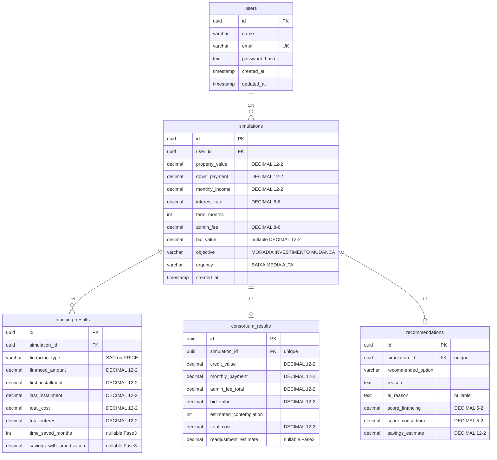

# Modelagem do Banco de Dados

## Visão Geral

O banco de dados do Casa Certa utiliza **PostgreSQL** com **Prisma ORM**. A modelagem armazena dados de entrada do usuário, resultados calculados por cada modalidade (SAC, PRICE, Consórcio) e a recomendação gerada pelo sistema de scoring e pela IA.

Todas as migrations são versionadas pelo Prisma, permitindo recriar o banco em qualquer máquina com `npx prisma migrate dev`.

---

## Diagrama Entidade-Relacionamento

---

## Detalhamento das Tabelas

### users

Armazena os usuários cadastrados no sistema.

| Campo | Tipo | Descrição |
|-------|------|-----------|
| id | UUID (PK) | Identificador único gerado automaticamente |
| name | VARCHAR | Nome completo do usuário |
| email | VARCHAR (UNIQUE) | Email usado para login — não permite duplicatas |
| password_hash | TEXT | Hash bcrypt da senha — nunca armazena a senha real |
| created_at | TIMESTAMP | Data/hora do cadastro (automático) |
| updated_at | TIMESTAMP | Última atualização (automático via Prisma) |

---

### simulations

Tabela central. Armazena os dados de entrada que o usuário preencheu no formulário de simulação.

| Campo | Tipo | Descrição |
|-------|------|-----------|
| id | UUID (PK) | Identificador da simulação |
| user_id | UUID (FK → users) | Usuário que criou a simulação |
| property_value | DECIMAL(12,2) | Valor do imóvel em reais |
| down_payment | DECIMAL(12,2) | Valor da entrada |
| monthly_income | DECIMAL(12,2) | Renda mensal do usuário |
| interest_rate | DECIMAL(8,6) | Taxa de juros mensal (ex: 0.009500 = 0,95%) |
| term_months | INT | Prazo em meses (ex: 360 = 30 anos) |
| admin_fee | DECIMAL(8,6) | Taxa administrativa mensal do consórcio |
| bid_value | DECIMAL(12,2)? | Valor do lance no consórcio (opcional) |
| objective | VARCHAR | MORADIA, INVESTIMENTO ou MUDANCA |
| urgency | VARCHAR | BAIXA, MEDIA ou ALTA |
| created_at | TIMESTAMP | Quando a simulação foi feita |

**Relacionamento:** User 1:N Simulation.

---

### financing_results

Resultados do financiamento. Cada simulação gera **2 registros**: SAC e PRICE.

| Campo | Tipo | Descrição |
|-------|------|-----------|
| id | UUID (PK) | Identificador do resultado |
| simulation_id | UUID (FK) | Simulação que gerou este resultado |
| financing_type | VARCHAR | "SAC" ou "PRICE" |
| financed_amount | DECIMAL(12,2) | Valor financiado (imóvel - entrada) |
| first_installment | DECIMAL(12,2) | Primeira parcela |
| last_installment | DECIMAL(12,2) | Última parcela |
| total_cost | DECIMAL(12,2) | Custo total do financiamento |
| total_interest | DECIMAL(12,2) | Total de juros pagos |
| time_saved_months | INT? | **[Fase 3]** Meses economizados com amortização extra |
| savings_with_amortization | DECIMAL(12,2)? | **[Fase 3]** Economia em reais com amortização extra |

**Relacionamento:** Simulation 1:N FinancingResult (SAC + PRICE = 2 registros por simulação).

---

### consortium_results

Resultado do consórcio. Relação **1:1** com simulação.

| Campo | Tipo | Descrição |
|-------|------|-----------|
| id | UUID (PK) | Identificador |
| simulation_id | UUID (FK, UNIQUE) | Simulação vinculada |
| credit_value | DECIMAL(12,2) | Valor da carta de crédito |
| monthly_payment | DECIMAL(12,2) | Parcela mensal |
| admin_fee_total | DECIMAL(12,2) | Total acumulado de taxa administrativa |
| bid_value | DECIMAL(12,2) | Valor do lance informado |
| estimated_contemplation | INT | Estimativa de contemplação em meses |
| total_cost | DECIMAL(12,2) | Custo total |
| readjustment_estimate | DECIMAL(12,2)? | **[Fase 3]** Estimativa de custo com reajuste anual |

---

### recommendations

Resultado do motor de recomendação. Relação **1:1** com simulação.

| Campo | Tipo | Descrição |
|-------|------|-----------|
| id | UUID (PK) | Identificador |
| simulation_id | UUID (FK, UNIQUE) | Simulação vinculada |
| recommended_option | VARCHAR | FINANCING_SAC, FINANCING_PRICE ou CONSORTIUM |
| reason | TEXT | Justificativa do motor de scoring |
| ai_reason | TEXT? | Análise gerada pela IA (Groq/Llama 3.3 70B) |
| score_financing | DECIMAL(5,2) | Score do financiamento (0-100) |
| score_consortium | DECIMAL(5,2) | Score do consórcio (0-100) |
| savings_estimate | DECIMAL(12,2) | Economia estimada da opção recomendada |

---

## Cenários Comparativos (Fase 3)

Na Fase 3, o sistema passou a calcular **11 cenários comparativos** via `scenarios.engine.ts`. Esses cenários são calculados em tempo real pelo backend e retornados na resposta da API, sem persistência em tabela separada:

| Cenário | Descrição |
|---------|-----------|
| SAC base | Tabela SAC sem amortização extra |
| SAC amortização no prazo | Aporte extra reduzindo o prazo total |
| SAC amortização na prestação | Aporte extra reduzindo o valor das parcelas |
| PRICE base | Tabela PRICE sem amortização extra |
| PRICE amortização no prazo | Aporte extra reduzindo o prazo total |
| PRICE amortização na prestação | Aporte extra reduzindo o valor das parcelas |
| SAC com juros +0,1% a.m. | Sensibilidade a aumento de taxa |
| SAC com juros -0,1% a.m. | Sensibilidade a redução de taxa |
| Consórcio sem reajuste | Índice fixo |
| Consórcio com INCC | Reajuste anual estimado de 6% |
| Consórcio com IPCA | Reajuste anual estimado de 4,5% |

Os resultados são armazenados nos campos `time_saved_months` e `savings_with_amortization` da tabela `financing_results`, e no campo `readjustment_estimate` da tabela `consortium_results`.

---

## Histórico de Migrations

| Migration | Data | Alteração |
|-----------|------|-----------|
| `init` | 2026-06-16 | Criação das 5 tabelas base |
| `add_advanced_fields` | 2026-06-17 | Adiciona `time_saved_months`, `savings_with_amortization` e `readjustment_estimate` |

---

## Decisões Técnicas

**Decimal vs Float:** Float tem erro de arredondamento binário. Em 360 parcelas, isso geraria divergência no custo total. Decimal é exato.

**UUIDs vs auto-increment:** Globalmente únicos, não expõem ordem de criação, facilitam escalabilidade.

**Campos opcionais (Fase 3):** Os 3 novos campos são nullable para manter retrocompatibilidade — simulações anteriores continuam funcionando.

**Cenários em tempo real vs tabela separada:** Os cenários comparativos são calculados on-the-fly pelo backend e não persistidos em tabela própria. Essa decisão evita complexidade desnecessária no banco, já que os cenários podem ser recalculados a qualquer momento a partir dos dados de entrada.

**onDelete: Cascade (pendente):** Recomenda-se adicionar `onDelete: Cascade` nas relações para que, ao deletar uma simulação, os resultados vinculados sejam removidos automaticamente.
